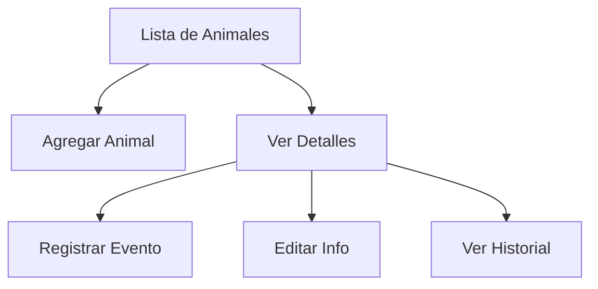
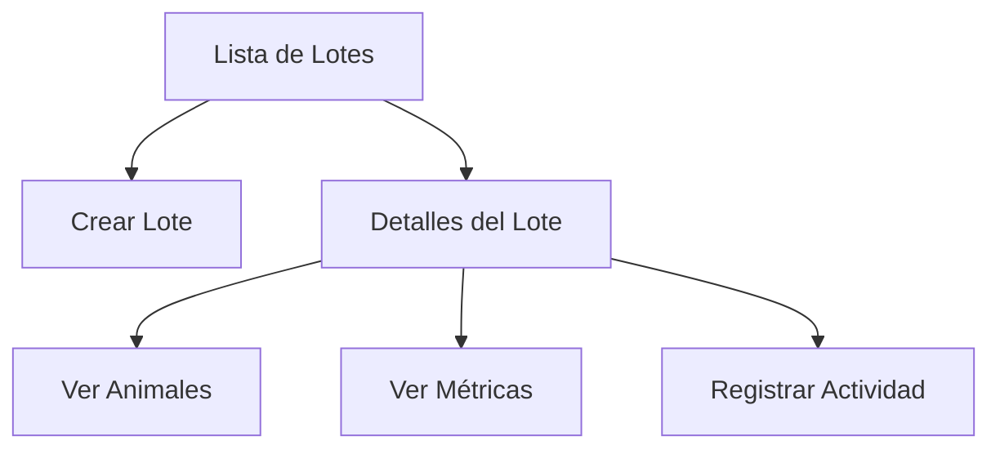

# PorkApp - Documentación

## Descripción General
PorkApp es una aplicación móvil diseñada para la gestión integral de granjas porcinas. Permite el seguimiento de animales, lotes, corrales y eventos relacionados con la producción porcina.

## Tecnologías Utilizadas
- **Framework**: Flutter
- **Base de Datos**: Supabase
- **Estado**: Riverpod
- **Autenticación**: Supabase Auth
- **Navegación**: Go Router
- **Persistencia Local**: SQLite (Drift)

## Estructura del Proyecto

### Arquitectura
El proyecto sigue una arquitectura basada en características (feature-first) con las siguientes capas:
- **Presentación**: Widgets, Vistas y Estados
- **Dominio**: Modelos y Lógica de Negocio
- **Datos**: Repositorios y Fuentes de Datos
- **Compartido**: Utilidades y Widgets Comunes

### Estructura de Carpetas
```
lib/
├── features/
│   ├── animals/         # Gestión de animales
│   ├── auth/           # Autenticación
│   ├── batches/        # Gestión de lotes
│   ├── biometrics/     # Autenticación biométrica
│   ├── corrals/        # Gestión de corrales
│   ├── dashboard/      # Panel principal
│   ├── home/          # Navegación principal
│   ├── reports/       # Informes y estadísticas
│   └── settings/      # Configuración
├── shared/
│   ├── design/        # Temas y estilos
│   ├── exceptions/    # Manejo de errores
│   └── widgets/       # Widgets compartidos
└── supabase/          # Configuración de Supabase
```

## Funcionalidades Principales

### 1. Dashboard
- **Resumen General**
  - KPIs principales:
    - Corrales activos y tasa de ocupación
    - Lotes en producción
    - Población animal total
    - Peso promedio y tendencias
  - Accesos rápidos a funciones principales
  - Vista de actividad reciente

### 2. Gestión de Lotes
- **Funcionalidades**:
  - Creación y edición de lotes
  - Seguimiento de estado del lote
  - Métricas clave:
    - ADG (Ganancia Diaria Promedio)
    - FCR (Tasa de Conversión Alimenticia)
    - Mortalidad
  - Historial de eventos del lote

### 3. Gestión de Animales
- **Características**:
  - Registro individual de animales
  - Seguimiento de peso y crecimiento
  - Eventos y tratamientos:
    - Pesajes
    - Vacunaciones
    - Tratamientos médicos
    - Enfermedades
  - Historial médico completo
  - Filtros y búsqueda avanzada

### 4. Gestión de Corrales
- **Funcionalidades**:
  - Asignación de animales a corrales
  - Control de capacidad y ocupación en tiempo real
  - Estado y disponibilidad de corrales
  - Historial de ocupación
  - **Vista de Corrales** (Actualizado 09/10/2025):
    - Diseño responsivo adaptado a dispositivos móviles
    - Una columna en móvil, tres en tablet y cuatro en escritorio
    - Tarjetas con encabezado dinámico según ocupación
    - Indicadores visuales de estado:
      - Verde: < 75% ocupación
      - Naranja: 75-90% ocupación
      - Rojo: > 90% ocupación
    - Información clara de capacidad y ocupación
    - Barra de progreso mejorada y más visible
    - Optimización de espacios y reducción de desbordamientos
    - Mejor legibilidad con tipografía optimizada
    - Validación de cambios de estado según ocupación

### 5. Biometrías y Estadísticas
- **Módulo de Biometrías**:
  - **Registro de Mediciones**:
    - Peso individual y grupal
    - Medidas morfométricas
    - Condición corporal
    - Registro de anomalías
  - **Tipos de Medición**:
    - Individual: animal específico
    - Grupal: promedio del lote
    - Muestral: subconjunto representativo
  - **Validaciones**:
    - Rangos permitidos por edad/etapa
    - Detección de valores atípicos
    - Consistencia histórica
    - Alertas de variaciones significativas

- **Análisis y Visualización**:
  - **Gráficos Interactivos**:
    - Curva de crecimiento
    - Distribución de pesos
    - Comparativa entre lotes
    - Tendencias temporales
  - **KPIs Principales**:
    - ADG (Average Daily Gain)
    - FCR (Feed Conversion Ratio)
    - Uniformidad del lote
    - Desviación del objetivo

- **Tipos de Informes**:
  - Rendimiento por lote
  - Estadísticas de mortalidad
  - Análisis de crecimiento
  - Eficiencia alimenticia
  - Tendencias de salud
  - Proyecciones de peso
  - Alertas y recomendaciones

- **Funcionalidades Avanzadas**:
  - Predicción de peso final
  - Detección temprana de problemas
  - Recomendaciones automáticas
  - Exportación de datos
  - Comparativa con estándares de la industria

### 6. Configuración y Seguridad
- **Características**:
  - Autenticación de usuarios
  - Autenticación biométrica
  - Perfiles de usuario
  - Preferencias de la aplicación
  - Modo sin conexión

## Características de la Interfaz

### Diseño Visual
- **Tema Principal**:
  - Paleta de colores profesional
  - Tipografía clara y legible
  - Iconografía consistente
  - Diseño adaptable a diferentes tamaños de pantalla

### Elementos de UI Comunes
- Tarjetas informativas
- Gráficos y visualizaciones
- Formularios intuitivos
- Diálogos de confirmación
- Indicadores de carga
- Mensajes de error amigables

## Flujos de Usuario Principales

### 1. Gestión de Animales


### 2. Gestión de Lotes


## Manejo de Errores
- Manejo de errores de red
- Validación de formularios
- Mensajes de error contextuales
- Recuperación de estados anteriores
- Persistencia de datos offline

## Seguridad
- Autenticación de usuarios
- Protección de datos sensibles
- Políticas de acceso RLS
- Validación de datos
- Encriptación de información sensible

## Rendimiento
- Carga lazy de datos
- Caché local
- Optimización de imágenes
- Paginación de listas grandes
- Actualización eficiente de UI

## Estructura de Datos - Biometrías

### Tabla `biometric_records`
```sql
CREATE TABLE biometric_records (
    id UUID PRIMARY KEY DEFAULT gen_random_uuid(),
    animal_id UUID REFERENCES animals(id),
    batch_id UUID REFERENCES batches(id),
    measurement_date TIMESTAMP WITH TIME ZONE DEFAULT now(),
    weight DECIMAL(10,2),
    height DECIMAL(10,2),
    length DECIMAL(10,2),
    girth DECIMAL(10,2),
    body_condition_score DECIMAL(3,1),
    notes TEXT,
    measurement_type VARCHAR(20), -- 'individual', 'group', 'sample'
    measured_by UUID REFERENCES auth.users(id),
    is_validated BOOLEAN DEFAULT false,
    validated_by UUID REFERENCES auth.users(id),
    validation_date TIMESTAMP WITH TIME ZONE,
    created_at TIMESTAMP WITH TIME ZONE DEFAULT now(),
    updated_at TIMESTAMP WITH TIME ZONE DEFAULT now()
);

-- Índices para optimización
CREATE INDEX idx_biometric_animal ON biometric_records(animal_id);
CREATE INDEX idx_biometric_batch ON biometric_records(batch_id);
CREATE INDEX idx_biometric_date ON biometric_records(measurement_date);
```

### Tabla `biometric_targets`
```sql
CREATE TABLE biometric_targets (
    id UUID PRIMARY KEY DEFAULT gen_random_uuid(),
    age_days INT,
    target_weight DECIMAL(10,2),
    min_weight DECIMAL(10,2),
    max_weight DECIMAL(10,2),
    genetic_line VARCHAR(50),
    sex VARCHAR(10),
    created_at TIMESTAMP WITH TIME ZONE DEFAULT now(),
    updated_at TIMESTAMP WITH TIME ZONE DEFAULT now()
);
```

## Estado del Proyecto
- **Versión**: 1.0.0
- **Plataformas**: Android
- **Requisitos Mínimos**:
  - Android 6.0 o superior
  - 2GB RAM
  - 100MB espacio libre

## Plan de Implementación - Biometrías

### Fase 1: Configuración Inicial
1. **Estructura de Base de Datos**
   - Crear tablas `biometric_records` y `biometric_targets`
   - Configurar índices y relaciones
   - Implementar políticas RLS de Supabase

2. **Modelos y Repositorios**
   - Crear modelos Dart con Freezed
   - Implementar repositorios con patrón CRUD
   - Configurar sincronización offline con Drift

### Fase 2: Lógica de Negocio
1. **Providers y Controllers**
   - BiometricProvider para estado global
   - BiometricController para lógica de UI
   - Validaciones y cálculos de métricas

2. **Servicios**
   - Servicio de cálculo de ADG
   - Servicio de análisis estadístico
   - Servicio de predicciones

### Fase 3: Interfaz de Usuario
1. **Vistas Principales**
   - Pantalla de registro de mediciones
   - Vista de historial
   - Gráficos y análisis

2. **Componentes**
   - Formulario de registro
   - Gráficos interactivos
   - Filtros y búsqueda
   - Indicadores de estado

### Fase 4: Testing y Optimización
1. **Pruebas**
   - Tests unitarios de cálculos
   - Tests de integración
   - Tests de UI/UX

2. **Optimización**
   - Caché de datos frecuentes
   - Paginación de históricos
   - Compresión de datos

## Próximas Funcionalidades
1. Integración con sistemas de alimentación
2. Módulo de costos y finanzas
3. Exportación de datos avanzada
4. Notificaciones push
5. Sincronización multi-dispositivo
6. Integración con básculas digitales
7. Análisis predictivo de crecimiento
8. Reportes personalizados de biometría