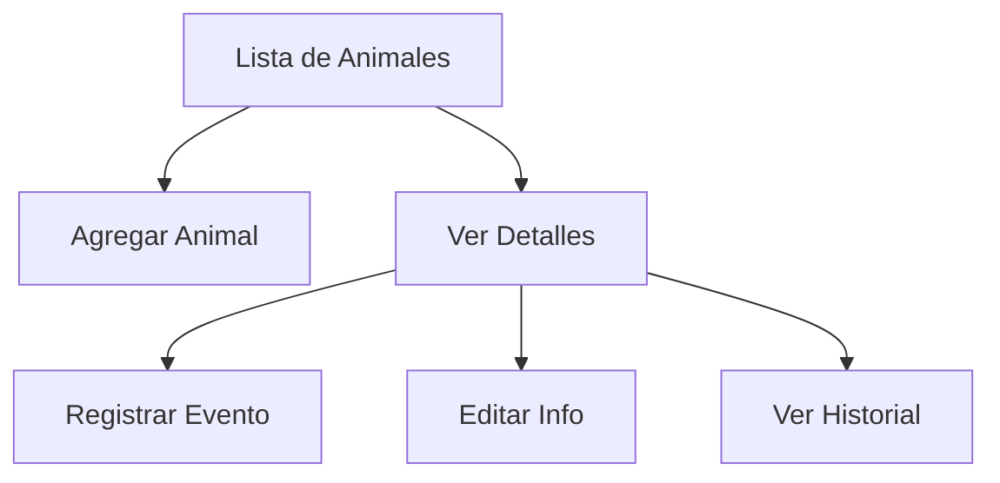
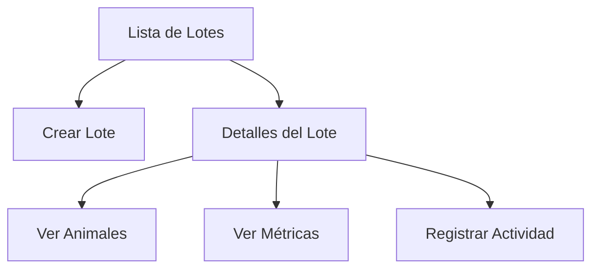

# PorkApp - Documentación

## Descripción General
PorkApp es una aplicación móvil diseñada para la gestión integral de granjas porcinas. Permite el seguimiento de animales, lotes, corrales y eventos relacionados con la producción porcina.

## Tecnologías Utilizadas
- **Framework**: Flutter
- **Base de Datos**: Supabase
- **Estado**: Riverpod
- **Autenticación**: Supabase Auth
- **Navegación**: Go Router
- **Persistencia Local**: SQLite (Drift)

## Estructura del Proyecto

### Arquitectura
El proyecto sigue una arquitectura basada en características (feature-first) con las siguientes capas:
- **Presentación**: Widgets, Vistas y Estados
- **Dominio**: Modelos y Lógica de Negocio
- **Datos**: Repositorios y Fuentes de Datos
- **Compartido**: Utilidades y Widgets Comunes

### Estructura de Carpetas
```
lib/
├── features/
│   ├── animals/         # Gestión de animales
│   ├── auth/           # Autenticación
│   ├── batches/        # Gestión de lotes
│   ├── biometrics/     # Autenticación biométrica
│   ├── corrals/        # Gestión de corrales
│   ├── dashboard/      # Panel principal
│   ├── home/          # Navegación principal
│   ├── reports/       # Informes y estadísticas
│   └── settings/      # Configuración
├── shared/
│   ├── design/        # Temas y estilos
│   ├── exceptions/    # Manejo de errores
│   └── widgets/       # Widgets compartidos
└── supabase/          # Configuración de Supabase
```

## Funcionalidades Principales

### 1. Dashboard
- **Resumen General**
  - KPIs principales:
    - Corrales activos y tasa de ocupación
    - Lotes en producción
    - Población animal total
    - Peso promedio y tendencias
  - Accesos rápidos a funciones principales
  - Vista de actividad reciente

### 2. Gestión de Lotes
- **Funcionalidades**:
  - Creación y edición de lotes
  - Seguimiento de estado del lote
  - Métricas clave:
    - ADG (Ganancia Diaria Promedio)
    - FCR (Tasa de Conversión Alimenticia)
    - Mortalidad
  - Historial de eventos del lote

### 3. Gestión de Animales
- **Características**:
  - Registro individual de animales
  - Seguimiento de peso y crecimiento
  - Eventos y tratamientos:
    - Pesajes
    - Vacunaciones
    - Tratamientos médicos
    - Enfermedades
  - Historial médico completo
  - Filtros y búsqueda avanzada

### 4. Gestión de Corrales
- **Funcionalidades**:
  - Asignación de animales a corrales
  - Control de capacidad y ocupación en tiempo real
  - Estado y disponibilidad de corrales
  - Historial de ocupación
  - **Vista de Corrales** (Actualizado 09/10/2025):
    - Diseño responsivo adaptado a dispositivos móviles
    - Una columna en móvil, tres en tablet y cuatro en escritorio
    - Tarjetas con encabezado dinámico según ocupación
    - Indicadores visuales de estado:
      - Verde: < 75% ocupación
      - Naranja: 75-90% ocupación
      - Rojo: > 90% ocupación
    - Información clara de capacidad y ocupación
    - Barra de progreso mejorada y más visible
    - Optimización de espacios y reducción de desbordamientos
    - Mejor legibilidad con tipografía optimizada
    - Validación de cambios de estado según ocupación

### 5. Informes y Estadísticas
- **Tipos de Informes**:
  - Rendimiento por lote
  - Estadísticas de mortalidad
  - Análisis de crecimiento
  - Eficiencia alimenticia
  - Tendencias de salud

### 6. Configuración y Seguridad
- **Características**:
  - Autenticación de usuarios
  - Autenticación biométrica
  - Perfiles de usuario
  - Preferencias de la aplicación
  - Modo sin conexión

## Características de la Interfaz

### Diseño Visual
- **Tema Principal**:
  - Paleta de colores profesional
  - Tipografía clara y legible
  - Iconografía consistente
  - Diseño adaptable a diferentes tamaños de pantalla

### Elementos de UI Comunes
- Tarjetas informativas
- Gráficos y visualizaciones
- Formularios intuitivos
- Diálogos de confirmación
- Indicadores de carga
- Mensajes de error amigables

## Flujos de Usuario Principales

### 1. Gestión de Animales


### 2. Gestión de Lotes


## Manejo de Errores
- Manejo de errores de red
- Validación de formularios
- Mensajes de error contextuales
- Recuperación de estados anteriores
- Persistencia de datos offline

## Seguridad
- Autenticación de usuarios
- Protección de datos sensibles
- Políticas de acceso RLS
- Validación de datos
- Encriptación de información sensible

## Rendimiento
- Carga lazy de datos
- Caché local
- Optimización de imágenes
- Paginación de listas grandes
- Actualización eficiente de UI

## Estado del Proyecto
- **Versión**: 1.0.0
- **Plataformas**: Android
- **Requisitos Mínimos**:
  - Android 6.0 o superior
  - 2GB RAM
  - 100MB espacio libre

## Próximas Funcionalidades
1. Integración con sistemas de alimentación
2. Módulo de costos y finanzas
3. Exportación de datos avanzada
4. Notificaciones push
5. Sincronización multi-dispositivo