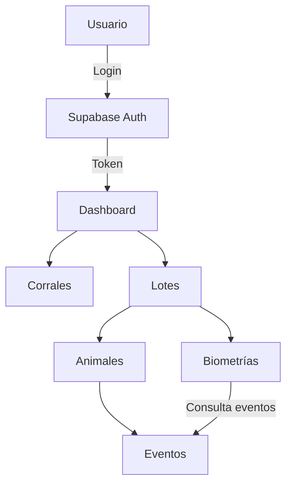

# 🐖 PorkApp — Criadero San Andrés  
**Versión:** v0.6  
**Autor:** Equipo de Desarrollo PorkApp  
**Última actualización:** Octubre 2025  

---

## 🎯 **Visión General**
PorkApp es una aplicación móvil Flutter diseñada para optimizar la gestión de producción porcina.  
Está enfocada en pequeños y medianos criaderos, con enfoque **offline-first**, interfaz clara, y métricas productivas accesibles.  

---

## 🧩 **Arquitectura General**
- **Framework:** Flutter 3.x  
- **Backend:** Supabase (PostgreSQL + Auth)  
- **State Management:** Riverpod  
- **Offline Storage:** Drift / SQLite  
- **Arquitectura:** Limpia por features  
  - `/domain` → Modelos, entidades  
  - `/data` → Repositorios, data sources  
  - `/providers` → Providers de estado  
  - `/presentation` → Vistas y widgets  

---

## 🧭 **Navegación principal (Bottom Nav Bar)**
| Sección | Ruta | Icono |
|----------|-------|-------|
| Dashboard | `/dashboard` | 🏠 |
| Corrales | `/corrals` | 🏗️ |
| Lotes | `/batches` | 📦 |
| Biometría | `/biometrics` | 📊 |

---

## 🌈 **Identidad Visual y Diseño**

### Paleta de colores
| Nombre | HEX | Uso |
|---------|------|-----|
| Verde campo | `#5CB85C` | Éxito, indicadores positivos |
| Rosa cerdito | `#FCD8D4` | Fondo suave |
| Coral | `#E94C5D` | Botones principales |
| Burdeos | `#3B1D2D` | Texto, títulos, barra de navegación |
| Beige claro | `#FDF6F3` | Fondo general |
| Blanco | `#FFFFFF` | Superficies y texto sobre fondo oscuro |

### Tipografía
- **Titulares:** Poppins Bold (22–26sp)  
- **Texto:** Poppins Regular (16sp)  
- **Datos numéricos:** Roboto Mono  

### Estilo visual general
- Bordes redondeados (16–24dp)  
- Sombras suaves  
- Íconos redondeados tipo Material Symbols  
- Espaciado amplio (8–16dp)  
- Contraste alto para uso en campo  

---

## 📱 **Pantallas y Requerimientos**
Incluye el diseño visual, estructura y comportamiento esperado en cada vista.

### 🔑 Login FASE 1 
- Logo centrado (cerdito guiñando el ojo)  
- Campos: Email, Contraseña  
- Botón “Entrar” coral  
- Validaciones básicas  
- Navegación → Dashboard  

### 🏠 Dashboard

#### Tarjeta de Bienvenida
- Diseño moderno con gradiente personalizado
- Avatar del usuario (si está disponible)
- Mensaje dinámico basado en la hora del día
- Datos del usuario actual (nombre, rol)
- Última actividad registrada

#### Panel de KPIs
- **Tarjetas con animación al cargar:**
  - 🏗️ Corrales Activos
    - Número total
    - Porcentaje de ocupación
    - Tendencia vs mes anterior
  - 📦 Lotes en Producción
    - Cantidad actual
    - Estado general
    - Próximos a finalizar
  - 🐷 Población Animal
    - Total de animales
    - Distribución por estado
    - Altas/bajas del día
  - ⚖️ Métricas de Peso
    - Peso promedio global
    - Ganancia diaria (ADG)
    - Tendencia semanal

#### Accesos Rápidos
- **Grid de tarjetas con iconos animados:**
  - 🏗️ Corrales → Gestión de espacios
  - 📦 Lotes → Control de producción
  - 🐷 Animales → Registro individual
  - 📊 Biometría → Análisis y métricas
  - 📝 Eventos → Registro rápido
  - 📈 Reportes → Informes del día

#### Panel de Actividad Reciente
- Timeline de últimas acciones
- Filtros por tipo de actividad
- Acceso rápido a detalles
- Notificaciones importantes

#### Elementos Flotantes
- Botón FAB para registro rápido
- Pull-to-refresh para actualizar datos
- Indicador de estado offline/online

### 🐖 Corrales
- Lista de corrales (nombre, ubicación, capacidad, lotes activos).  
- Formulario de creación simple (nombre, capacidad, ubicación).  
- Botón guardar verde.  

### 📦 Lotes
- Cards con nombre, fecha inicio, cantidad, peso inicial, estado.  
- Botón flotante coral (+).  
- Detalle del lote: información general, lista de animales, botón “Agregar Animal”.  

### 🐷 Animales
- Lista: ID, peso, raza, estado.  
- Crear/editar: formulario con tipo, arete, peso inicial, raza, género.  
- Detalle de animal: eventos asociados (pesajes, tratamientos).  

### 📑 Eventos
- Tipos: pesaje, tratamiento, mortalidad, movimiento, nota.  
- Formulario dinámico según tipo.  
- Línea de tiempo visible en el detalle de animal.  

### 📊 Biometrías
- Selector de lote.  
- Tarjetas KPI (ADG, FCR, Mortalidad).  
- Gráficas:  
  - Línea → evolución peso promedio.  
  - Barras → mortalidad por causa.  

---

## 🧮 **Cálculos clave**
| Métrica | Fórmula |
|----------|----------|
| ADG | (Peso final − Peso inicial) / Días |
| FCR | Alimento entregado / Ganancia de peso |
| Mortalidad | (Bajas / Población inicial) × 100 |

---

## 🗄️ **Estructura de Datos (Supabase)**

### Tabla `batches`
```sql
id uuid primary key default gen_random_uuid(),
name text,
start_date date,
headcount_start int,
initial_avg_weight numeric,
corral_id uuid references corrals(id),
notes text,
created_at timestamp default now()
```

### Tabla `animals`
```sql
id uuid primary key default gen_random_uuid(),
batch_id uuid references batches(id) on delete cascade,
identifier text,
entry_date date,
initial_weight numeric,
breed text,
gender text,
status text default 'active',
notes text,
created_at timestamp default now()
```

### Tabla `animal_events`
```sql
id uuid primary key default gen_random_uuid(),
animal_id uuid references animals(id) on delete cascade,
event_date date,
type text,
weight numeric,
qty_feed numeric,
cause text,
product text,
dose text,
notes text,
created_at timestamp default now()
```

---

## 🧠 **Flujo de datos**


---

## 🧩 **Providers Principales**
- `auth_provider.dart` → Sesión y validación de usuario  
- `batch_provider.dart` → CRUD de lotes  
- `animals_provider.dart` → CRUD de animales  
- `animal_events_provider.dart` → CRUD de eventos  
- `biometrics_provider.dart` → Métricas de producción  

---

## 📋 **Plan de Implementación — Biometrías**
1. Crear consultas SQL en Supabase (ADG, FCR, Mortalidad).  
2. Implementar en `animal_events_repository.dart`.  
3. Conectar con `biometrics_provider.dart`.  
4. Mostrar KPIs en `biometrics_view.dart`.  
5. Agregar gráficas interactivas.  
6. Validar datos y estados vacíos.  
7. Guardar últimos resultados localmente (offline).  

---

## 🎨 **Guía de Estilo (UI Kit)**
| Elemento | Estilo |
|-----------|--------|
| Botones | Redondeados, coral o verde según acción |
| Campos | Borde suave, fondo blanco |
| Tarjetas | Fondo rosa claro, sombra leve |
| Íconos | Outline redondeado |
| Títulos | Burdeos oscuro |
| Diálogos | Esquinas grandes, fondo translúcido |

---

## 🪶 **Branding**
**Criadero San Andrés**  
📍 San Diego – Cesar  
📞 316 388 2210  
📷 Instagram: `@criadero_sanandres`  

> “Productividad, bienestar animal y trazabilidad al alcance del productor.”
